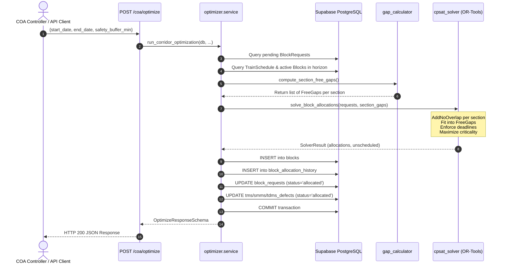

# SIH26027 — Automatic Block Planning System
## Part 2: Google OR-Tools CP-SAT Optimizer Core & `/coa/optimize` Endpoint

---

### 1. Executive Summary & What Was Built

In **Part 2**, we implemented the core algorithmic heart of the automatic block planning prototype: a constraint-programming optimizer powered by **Google OR-Tools CP-SAT**, integrated seamlessly into the **FastAPI + SQLAlchemy** architecture established in Part 1.

Key accomplishments in Part 2:
- **Corridor Gap Calculation Engine (`backend/optimizer/gap_calculator.py`)**:
  - Automatically fetches all train movements from `train_schedule` and active blocks from `blocks` for the selected date horizon.
  - Applies a configurable safety buffer (e.g. 10 minutes) before train arrival and after train exit.
  - Merges overlapping or adjacent occupancies and inverts the timeline to compute exact, collision-free maintenance windows per section.
- **CP-SAT Mathematical Model (`backend/optimizer/cpsat_solver.py`)**:
  - Discretizes time into minute-level integer coordinates over the planning horizon.
  - Uses CP-SAT `NewOptionalIntervalVar` and `AddNoOverlap` to mathematically guarantee that **no two blocks ever collide on the same block section**.
  - Restricts block start and end times to lie strictly within legitimate free gaps.
  - Enforces the `required_by` deadline for each maintenance defect.
  - Maximizes total scheduled `criticality_score`, using a minor tie-breaker to prefer earlier start windows.
- **Transactional Database Write-Back (`backend/optimizer/service.py`)**:
  - Uses SQLAlchemy sessions with eager loading and explicit flushing to atomically write scheduled allocations:
    1. Inserts primary block rows into `blocks`.
    2. Inserts immutable audit records into `block_allocation_history` with `reason='initial_allocation'`.
    3. Flips `block_requests.status` from `'pending'` to `'allocated'`.
    4. Mirrors `'allocated'` status back onto the originating defect row (`tms_defects`, `smms_defects`, or `tdms_defects`).
- **REST API Endpoint (`backend/routes/coa.py`)**:
  - `POST /coa/optimize` — Triggers the optimizer over any chosen date horizon and returns a structured breakdown of scheduled vs. unscheduled items.
- **Verification & Testing (`backend/tests/test_part2.py` & `verify_part2.py`)**:
  - 7 new automated tests covering interval merging, buffer calculation, CP-SAT constraints, and end-to-end database write-back.
  - Complete test suite now has **15 passing tests** across Part 1 and Part 2 in under 18 seconds.

---

### 2. Integration with Part 1 Architecture

Part 2 directly extends the existing FastAPI and SQLAlchemy codebase from Part 1 without altering or duplicating any existing structures:

```
FINAL/
├── backend/
│   ├── database.py             # Part 1: SQLAlchemy engine, SessionLocal, get_db
│   ├── models.py               # Part 1: ORM models + Part 2: relationships for BlockAllocationHistory
│   ├── schemas.py              # Part 1: Data schemas + Part 2: OptimizeRequestSchema & OptimizeResponseSchema
│   ├── main.py                 # Part 1: App entrypoint & CORS
│   ├── routes/
│   │   ├── coa.py              # Part 1: GET /coa/stations, /sections, /trains, /blocks
│   │   │                       # Part 2: POST /coa/optimize added here
│   │   └── departments.py      # Part 1: GET & POST /departments/{dept}/defects
│   ├── optimizer/              # Part 2: NEW OPTIMIZER MODULE
│   │   ├── __init__.py
│   │   ├── gap_calculator.py   # Buffer padding, interval merging, and free gap computation
│   │   ├── cpsat_solver.py     # OR-Tools CP-SAT variables, NoOverlap constraints, and solver
│   │   └── service.py          # SQLAlchemy coordination, data gathering, and transactional write-back
│   └── tests/
│       ├── test_part1.py       # Part 1 test suite (8 tests)
│       └── test_part2.py       # Part 2 test suite (7 tests)
├── verify_part1.py             # Part 1 standalone CLI runner
├── verify_part2.py             # Part 2 standalone CLI runner
├── README_PART_1.md            # Part 1 documentation
└── README_PART_2.md            # Part 2 documentation (this file)
```

#### How Data Flows Through the Optimizer:


---

### 3. CP-SAT Mathematical Model Details

#### A. Discretization & Time Coordinate System
- Let $t_0 = \text{horizon\_start}$ (UTC).
- Every timestamp $T$ is mapped to an integer minute offset:
  $$m(T) = \left\lfloor \frac{T - t_0}{60} \right\rfloor$$
- The planning horizon length is $H = m(\text{horizon\_end})$.

#### B. Free Gap Formulation
- For train occupancy $[s_{\text{entry}}, e_{\text{exit}}]$ with safety buffer $B$ (default 10 min):
  $$[\max(0, s_{\text{entry}} - B), \min(H, e_{\text{exit}} + B)]$$
- For existing active blocks $[s_{\text{block}}, e_{\text{block}}]$:
  $$[\max(0, s_{\text{block}}), \min(H, e_{\text{block}})]$$
- Overlapping intervals are merged using `merge_intervals()`.
- The complement of merged intervals yields disjoint free gaps $g \in G_{\text{section}}$ where $g = [s_g, e_g]$ with duration $D_g = e_g - s_g$.

#### C. Decision Variables & Constraints
For each pending request $r$ with duration $D_r$, section $sec(r)$, criticality $W_r$, and deadline $M_r$:
1. **Scheduling Decision**: Boolean variable $is\_scheduled_r \in \{0, 1\}$.
2. **Gap Selection**: Boolean variable $x_{r, g} \in \{0, 1\}$ for each gap $g \in G_{sec(r)}$ that satisfies $D_g \ge D_r$ and $s_g + D_r \le M_r$:
   $$\sum_{g} x_{r, g} = is\_scheduled_r$$
3. **Start & End Time Variables**:
   $$start\_var_r \in [0, H - D_r], \quad end\_var_r = start\_var_r + D_r$$
   When gap $g$ is chosen ($x_{r, g} = 1$):
   $$start\_var_r \ge s_g, \quad end\_var_r \le \min(e_g, M_r)$$
4. **No-Overlap Constraint**:
   An optional interval variable is defined:
   $$I_r = \text{NewOptionalIntervalVar}(start\_var_r, D_r, end\_var_r, is\_scheduled_r)$$
   For each corridor section $sec$:
   $$\text{AddNoOverlap}(\{I_r \mid sec(r) = sec\})$$

#### D. Objective Function
$$\text{Maximize } \sum_{r} \Big( 1000 \cdot W_r \cdot is\_scheduled_r - start\_var_r \Big)$$
- $1000 \cdot W_r \cdot is\_scheduled_r$ ensures scheduling high-criticality defects is always the top priority.
- $- start\_var_r$ acts as a tie-breaker, placing equal-criticality tasks in the earliest viable window.

---

### 4. API Reference: `POST /coa/optimize`

#### Request Endpoint
- **URL**: `http://localhost:8000/coa/optimize`
- **Method**: `POST`
- **Content-Type**: `application/json`

#### Request Body Parameters
| Field | Type | Required | Default | Description |
| :--- | :--- | :--- | :--- | :--- |
| `start_date` | `string (YYYY-MM-DD)` | Yes | — | Horizon start date |
| `end_date` | `string (YYYY-MM-DD)` | Yes | — | Horizon end date (inclusive) |
| `safety_buffer_min` | `integer` | No | `10` | Safety padding before and after train occupancy |
| `max_solve_time_sec` | `integer` | No | `30` | Max solver search time limit |

#### Example Request Payload
```json
{
  "start_date": "2026-09-04",
  "end_date": "2026-09-10",
  "safety_buffer_min": 10,
  "max_solve_time_sec": 15
}
```

#### Example Response Payload
```json
{
  "status": "OPTIMAL",
  "horizon_start": "2026-09-04T00:00:00Z",
  "horizon_end": "2026-09-10T23:59:59Z",
  "total_pending_requests": 1,
  "scheduled_count": 1,
  "unscheduled_count": 0,
  "total_criticality_scheduled": 92,
  "allocations": [
    {
      "block_id": "cdec255f-8255-442c-a2b1-9fb92518e950",
      "block_request_id": "4d55e079-5735-4309-8472-bb97e59b9c9f",
      "block_section_id": "d5ebfbe6-4bf1-4d70-9899-d6408729da5d",
      "section_code": "VSKP-DVD-DN",
      "planned_start": "2026-09-04T00:00:00Z",
      "planned_end": "2026-09-04T01:00:00Z",
      "duration_min": 60,
      "criticality_score": 92,
      "source_system": "TMS",
      "defect_code": "VERIFY-2FBA5D",
      "defect_type": "Verification Track Irregularity"
    }
  ],
  "unscheduled_request_ids": [],
  "execution_time_ms": 1852.01
}
```

---

### 5. How to Run Tests and Verification

#### Run Part 2 Tests Only
```powershell
.\myenv\Scripts\pytest.exe backend/tests/test_part2.py -v
```
Expected output:
```
============================= 7 passed in 10.83s ==============================
```

#### Run All Test Suites (Part 1 + Part 2)
```powershell
.\myenv\Scripts\pytest.exe backend/tests/ -v
```
Expected output:
```
============================= 15 passed in 17.38s =============================
```

#### Run Standalone Verification Script
```powershell
.\myenv\Scripts\python.exe verify_part2.py
```
This script validates OR-Tools, verifies the gap calculation mathematics, executes the CP-SAT solver, tests the `/coa/optimize` endpoint, creates a test request to prove database write-back, and cleanly cleans up.

---

### 6. Troubleshooting & Debugging Guide

#### Issue A: `status: "NO_PENDING_REQUESTS"`
- **Explanation**: This is normal behavior when all block requests in the database are already marked `allocated` or `rejected`.
- **Diagnosis**: To verify the optimizer's active scheduling logic, run `verify_part2.py` which dynamically generates a temporary pending request, schedules it, verifies DB write-back, and cleans up.

#### Issue B: Request Unscheduled (`unscheduled_count > 0`)
- **Root Cause**:
  1. No free gap on that section has `duration >= estimated_duration_min`.
  2. The defect deadline (`required_by`) expired before any viable gap occurred.
  3. Other higher-criticality requests on the same section claimed the available window (`NoOverlap` constraint).
- **Diagnosis**: Inspect `data["unscheduled_request_ids"]`. Check the section's train density using `GET /coa/trains?date=YYYY-MM-DD`.

#### Issue C: Solver Exceeds Timeout
- **Diagnosis**: If the horizon is very large (e.g. 30 days) with hundreds of requests, adjust `max_solve_time_sec` in the request payload (e.g. `max_solve_time_sec: 60`).

---

### 7. Readiness for Part 3

With Part 2 complete and verified:
- The OR-Tools CP-SAT optimizer core is fully functional.
- The `POST /coa/optimize` endpoint is live and verified.
- The system is ready to proceed to **Part 3: Shadow-Block Detection & Approval Flow (`/coa/shadow-check`, `/coa/shadow-attach`)**.
