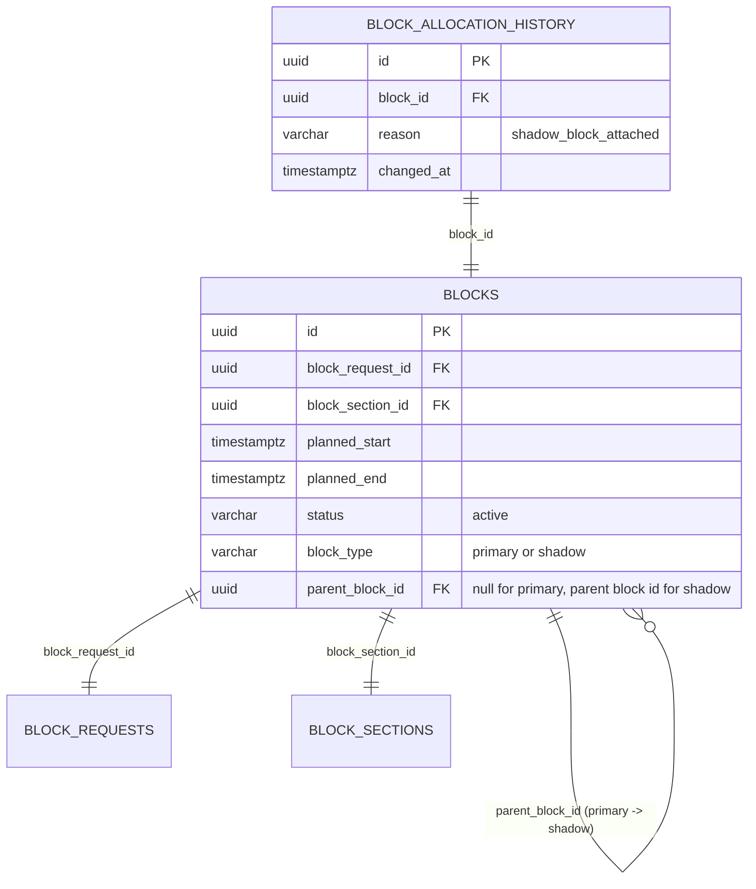

# SIH26027 — Automatic Block Planning System
## Part 3: Shadow-Block Detection & Controller Approval Flow

---

### 1. Executive Summary & What Was Built

In **Part 3**, we implemented the **Shadow-Block Detection and Controller Governance Engine** (`backend/shadow/engine.py`). 

A **Shadow Block** is a secondary maintenance window granted to another department on the **exact same block section** during an already-approved primary block. Because the block section is already closed to traffic for the primary block, shadow blocks consume **zero additional corridor capacity** and cause **zero additional train delays**.

Key accomplishments in Part 3:
- **Strict Structural Constraint Engine (`backend/shadow/engine.py`)**:
  - **Exact Section Match**: Candidate maintenance must be on the exact same block section as the primary block.
  - **Duration Window Fit**: Candidate duration must fit completely inside the primary block's window:
    $$D_{\text{candidate}} \le D_{\text{primary}}$$
  - **Deadline Satisfaction**: The primary block's scheduled window must finish on or before the candidate defect's deadline:
    $$\text{planned\_end}(B_{\text{primary}}) \le \text{required\_by}$$
  - **Proximity & Fit Scoring**: Evaluates candidate fit ratio ($D_{\text{cand}} / D_{\text{prim}}$), criticality score, and margin hours before deadline.
- **Controller Approval & Discard Workflow**:
  - **No Blind Auto-Attachment**: Shadow blocks are surfaced as actionable proposals for human controller review.
  - `POST /coa/shadow-attach`: Controller approves the proposal. Atomically creates a child block with `block_type='shadow'` and `parent_block_id=primary_block.id`, logs an audit trail in `block_allocation_history`, marks the defect and request as `'allocated'`, and generates a **GREEN approval notification**.
  - `POST /coa/shadow-discard`: Controller declines the proposal. Records the controller's operational reason and generates a **RED decline notification** flowing back to the requesting department.
- **Corridor-Wide Opportunity Discovery (`GET /coa/shadow-opportunities`)**:
  - Scans all active primary blocks across the Visakhapatnam–Vijayawada corridor to locate all available piggyback slots.
- **Automated Verification Suite (`backend/tests/test_part3.py` & `verify_part3.py`)**:
  - 4 automated tests verifying constraint enforcement, rejection of duration violations, controller approval, and audit history creation.
  - Total test suite now stands at **19 passing tests** across Parts 1, 2, and 3.

---

### 2. Integration with Parts 1 & 2 Architecture

Part 3 seamlessly connects to the existing **FastAPI + SQLAlchemy** foundation:

```
FINAL/
├── backend/
│   ├── database.py             # SQLAlchemy engine, SessionLocal, get_db
│   ├── models.py               # Block, BlockRequest, BlockAllocationHistory, defect models
│   ├── schemas.py              # Pydantic schemas (added ShadowCheck, ShadowAttach, ShadowDiscard)
│   ├── main.py                 # FastAPI app entrypoint
│   ├── routes/
│   │   ├── coa.py              # Added shadow endpoints: /shadow-check, /shadow-opportunities,
│   │   │                       # /shadow-attach, /shadow-discard
│   │   └── departments.py      # Department defect queues (TMS, SMMS, TDMS)
│   ├── optimizer/              # Part 2: OR-Tools CP-SAT primary block solver
│   ├── shadow/                 # Part 3: NEW SHADOW BLOCK MODULE
│   │   ├── __init__.py
│   │   └── engine.py           # Candidate discovery, constraint enforcement, approval write-back
│   └── tests/
│       ├── test_part1.py       # Part 1 tests (8 tests)
│       ├── test_part2.py       # Part 2 tests (7 tests)
│       └── test_part3.py       # Part 3 tests (4 tests)
├── verify_part1.py             # Part 1 verification CLI
├── verify_part2.py             # Part 2 verification CLI
├── verify_part3.py             # Part 3 verification CLI (this part)
├── check_defect_allocation_status.py # Audit tool for defect & block statuses
├── README_PART_1.md            # Part 1 guide
├── README_PART_2.md            # Part 2 guide
└── README_PART_3.md            # Part 3 guide (this file)
```

#### How Shadow Blocks Relate to Primary Blocks in the Database:


---

### 3. Structural Constraints Governing Shadow Blocks

| Constraint | Rule | Purpose |
| :--- | :--- | :--- |
| **1. Same Section** | `cand.block_section_id == prim.block_section_id` | A shadow team can only work on track that is already closed. |
| **2. Duration Fit** | `cand.duration_min <= prim.duration_min` | Work must finish before the primary block window expires. |
| **3. Deadline Compliance** | `prim.planned_end <= cand.required_by` | Work must happen before the defect's safety deadline expires. |
| **4. Time Proximity** | `shadow_start = prim.planned_start` | The shadow team mobilizes during the approved primary block window. |
| **5. Controller Approval** | Explicit HTTP POST `/coa/shadow-attach` | Prevents automated conflict; controller retains ultimate operational authority. |
| **6. Full Audit Traceability** | `history.reason = 'shadow_block_attached'` | Immutable record of why and when the shadow block was attached. |

---

### 4. API Reference & Usage Guide

#### A. Scan Corridor for Shadow Opportunities
- **Endpoint**: `GET /coa/shadow-opportunities`
- **Description**: Scans all active primary blocks on the corridor and returns those with $\ge 1$ viable shadow candidates.
- **Example Response**:
```json
[
  {
    "primary_block_id": "edd7fd7d-a12b-4567-8901-cdef01234567",
    "block_section_id": "d5ebfbe6-4bf1-4d70-9899-d6408729da5d",
    "section_code": "VSKP-DVD-DN",
    "primary_start": "2026-09-08T01:30:00Z",
    "primary_end": "2026-09-08T03:30:00Z",
    "primary_duration_min": 120,
    "primary_source_system": "TDMS",
    "primary_defect_code": "TDMS-SEP-003",
    "candidate_count": 1,
    "candidates": [
      {
        "candidate_type": "defect",
        "candidate_id": "7b8e1a2c-3d4e-5f60-7182-93a4b5c6d7e8",
        "defect_id": "7b8e1a2c-3d4e-5f60-7182-93a4b5c6d7e8",
        "source_system": "TMS",
        "defect_code": "TMS-NEW-0021",
        "defect_type": "Test Rail Fracture",
        "criticality_score": 75,
        "estimated_duration_min": 90,
        "required_by": null,
        "duration_fit_ratio": 0.75,
        "margin_before_deadline_hours": null,
        "recommendation_reason": "Fits within primary window (90m <= 120m) on same section. Zero additional train delays."
      }
    ]
  }
]
```

#### B. Check Candidates for a Specific Block
- **Endpoint**: `POST /coa/shadow-check`
- **Request Body**:
```json
{
  "block_id": "edd7fd7d-a12b-4567-8901-cdef01234567"
}
```

#### C. Controller Approval & Shadow Block Attachment
- **Endpoint**: `POST /coa/shadow-attach`
- **Request Body**:
```json
{
  "primary_block_id": "edd7fd7d-a12b-4567-8901-cdef01234567",
  "defect_id": "7b8e1a2c-3d4e-5f60-7182-93a4b5c6d7e8",
  "department": "TMS"
}
```
- **Response**:
```json
{
  "status": "APPROVED",
  "shadow_block_id": "0a94d48d-9d7d-4b8f-995a-6df732bf8e4b",
  "parent_block_id": "edd7fd7d-a12b-4567-8901-cdef01234567",
  "block_section_id": "d5ebfbe6-4bf1-4d70-9899-d6408729da5d",
  "section_code": "VSKP-DVD-DN",
  "planned_start": "2026-09-08T01:30:00Z",
  "planned_end": "2026-09-08T03:00:00Z",
  "duration_min": 90,
  "source_system": "TMS",
  "defect_code": "TMS-NEW-0021",
  "message": "Shadow block successfully attached to primary block.",
  "notification": {
    "type": "SHADOW_BLOCK_APPROVED",
    "department": "TMS",
    "defect_code": "TMS-NEW-0021",
    "color": "green",
    "title": "Shadow Block Approved (TMS)",
    "message": "COA Controller approved Shadow Block for TMS-NEW-0021 on section VSKP-DVD-DN piggybacking on primary block #edd7fd7d (08-Sep 01:30 to 03:00). Corridor availability maximized with 0 additional train delay.",
    "timestamp": "2026-09-04T13:56:00Z"
  }
}
```

#### D. Controller Discards Shadow Proposal
- **Endpoint**: `POST /coa/shadow-discard`
- **Request Body**:
```json
{
  "primary_block_id": "edd7fd7d-a12b-4567-8901-cdef01234567",
  "department": "TMS",
  "reason": "Civil engineering gang busy on adjacent line"
}
```
- **Response**: Returns red notification payload with controller explanation.

---

### 5. How to Run Tests and Verification

#### Run Part 3 Tests Only
```powershell
.\myenv\Scripts\pytest.exe backend/tests/test_part3.py -v
```
Expected output:
```
============================= 4 passed in 27.39s ==============================
```

#### Run Full Test Suite (Parts 1, 2, and 3)
```powershell
.\myenv\Scripts\pytest.exe backend/tests/ -v
```
Expected output:
```
============================= 19 passed in 44.00s =============================
```

#### Run Standalone Verification Script
```powershell
.\myenv\Scripts\python.exe verify_part3.py
```
This script tests corridor opportunity discovery, specific candidate checks, duration constraint rejection, controller discard flow (red notification), and dynamic shadow block attachment (green notification + DB write-back verification).

---

### 6. Troubleshooting & Debugging Guide

#### Issue A: `Duration violation: Candidate duration exceeds primary window`
- **Explanation**: The candidate work requires more minutes than the primary block is allocated for.
- **Fix**: The candidate cannot be attached as a shadow block to this primary block. It must either be attached to a longer primary block or allocated its own primary slot via `/coa/optimize`.

#### Issue B: `Deadline violation: Primary block end exceeds candidate deadline`
- **Explanation**: The primary block takes place after the candidate defect's required safety deadline (`required_by`).
- **Fix**: The candidate must be scheduled earlier to avoid safety violations.

#### Issue C: `Target block must be a primary block, not a shadow block`
- **Explanation**: Shadow blocks cannot be nested into other shadow blocks; they must attach directly to a primary block.

---

### 7. Readiness for Part 4

With Part 3 complete and verified:
- The Shadow Block engine is operational and enforced by railway domain constraints.
- The 29 primary blocks remain intact, and shadow opportunities are discovered and approved on demand.
- The system is ready to proceed to **Part 4: Explainable ML Criticality Scoring Service (Phase C)**.
